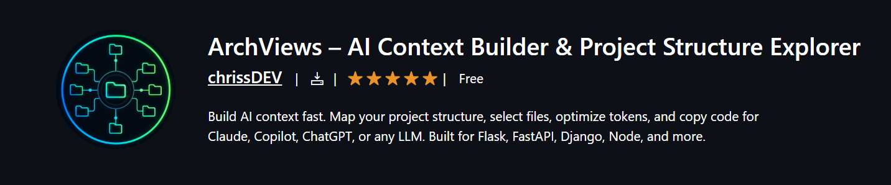

# PyPoints — Python API Tester, REST Client & Endpoint Explorer for VS Code

> **Aviso :** estamos trabajando para que pypoints maneje otros lenguajes de programacion y no solo python

---

## El mejor Python API Tester y REST Client para VS Code

**PyPoints** es una extensión para Visual Studio Code que funciona como un **Python API tester, REST client y endpoint explorer todo en uno**. Escanea automáticamente proyectos Flask, FastAPI y Django, mapea cada ruta y permite enviar peticiones HTTP (GET, POST, PUT, DELETE, PATCH) directamente desde el editor — sin Postman, sin Insomnia, sin cambiar de ventana.

> Compatible con **Flask**, **FastAPI** y **Django** desde el primer momento. Sin configuración adicional.

---

## Por qué los desarrolladores Python eligen PyPoints sobre Postman

En proyectos backend reales, los endpoints están dispersos en múltiples archivos, lo que dificulta:

- Entender la arquitectura completa de la API de un vistazo
- Detectar errores de rutas antes de llegar a producción
- Mantener consistencia entre rutas, métodos y handlers
- Navegar rápidamente entre funcionalidades sin perder el foco

PyPoints resuelve todo esto con **análisis estático inteligente + testing REST integrado + historial permanente de peticiones** — todo dentro de VS Code.

---

## Características clave — Python REST Client y API Explorer

- **Escáner de Endpoints Inteligente** — Soporte nativo para decoradores de Flask, FastAPI y Django
- **REST Client Integrado** — Configura Headers, Query Params y Body (JSON/Form) con interfaz gráfica
- **Historial Permanente** — Tus pruebas de API persisten entre sesiones de VS Code
- **Explorador Visual de Endpoints** — Vista jerárquica en el panel lateral de VS Code
- **API Linter** — Detecta rutas duplicadas, código muerto, returns faltantes y malas prácticas
- **Generador de Snippets cURL** — Copia comandos cURL listos para ejecutar con un clic
- **Filtros Avanzados** — Busca por método, archivo, ruta o estado de la ruta
- **Documentación Instantánea** — Exporta la arquitectura completa a JSON o Markdown

---

## Detalle de funcionalidades

### 1. REST Client Nativo y Testing de APIs para Flask, FastAPI, Django

Envía peticiones HTTP reales sin salir de VS Code. PyPoints reemplaza Postman e Insomnia para el desarrollo backend del día a día.

- Configuración completa de peticiones: variables, headers, body JSON/Form
- Visualizador de respuesta: código de estado, Headers, Body, tiempo de respuesta
- **Historial Permanente:** Las pruebas y respuestas se guardan entre sesiones. Cierra VS Code, vuelve mañana — tu trabajo estará exactamente donde lo dejaste.

---

### 2. Explorador de Endpoints Python — Navegación centralizada de rutas


Visualiza todos los endpoints de tu API en un explorador integrado dentro de VS Code.

- Estructura jerárquica clara para navegación rápida
- Agrupa endpoints por archivo o categoría
- Salta al código fuente con un solo clic
- Escala a monolitos grandes y arquitecturas de microservicios

> Elimina por completo la necesidad de buscar manualmente decoradores de rutas en decenas de archivos.

---

### 3. Búsqueda y filtrado avanzado


Encuentra cualquier endpoint en segundos en proyectos Python grandes.

- Busca por nombre, ruta, método HTTP o archivo
- Filtros rápidos: muestra solo rutas GET, POST, PUT o DELETE
- Vista exclusiva de endpoints con problemas detectados

---

### 4. Vista previa interactiva de endpoints


Cada endpoint tiene un panel dedicado que muestra:

- Código fuente formateado y aislado
- Métodos HTTP soportados e información estructurada
- Indicadores visuales de estado
- Comando cURL generado automáticamente
- Botón de lanzamiento directo al cliente REST integrado

---

### 5. Análisis estático y API Linting

PyPoints evalúa la calidad de tus endpoints sin necesidad de ejecutar el servidor. Detecta:

- Sentencias `print()` que podrían filtrar información sensible en producción
- Funciones sin sentencia `return`
- Parámetros inválidos y patrones de rutas malformados
- Nombres de funciones poco descriptivos


---

### 6. Detección de rutas duplicadas y prevención de colisiones


Detecta errores críticos de arquitectura antes de llegar a producción:

- Rutas duplicadas bajo el mismo método HTTP
- Funciones de handler repetidas o sobreescritas accidentalmente
- Colisiones silenciosas de comportamiento difíciles de depurar

> Este tipo de errores suele ser invisible hasta que causa fallos en producción.

---

### 7. Clasificación de complejidad

Analiza automáticamente la carga cognitiva de cada endpoint:

```
Simple   (I)   — handler directo, lógica mínima
Medio    (II)  — ramificación moderada o dependencias
Complejo (III) — candidato a refactorización, extraer lógica de negocio
```

---

### 8. Exportación de documentación — Markdown y JSON

Genera documentación lista para el equipo de forma instantánea.

- **Exportación Markdown** — ideal para PRs, wikis y especificaciones técnicas
- **Exportación JSON** — para pipelines CI/CD e integraciones con otras herramientas

---

## Frameworks soportados

| Framework | Detección de decoradores | Testing REST | Linting |
|-----------|--------------------------|--------------|---------|
| **Flask** | `@app.route`, `@blueprint.route` | Si | Si |
| **FastAPI** | `@app.get`, `@router.post`, etc. | Si | Si |
| **Django** | `path()`, `re_path()`, `@api_view` | Si | Si |

---

## Inicio rápido — Prueba tu primer endpoint en 30 segundos

1. Abre tu proyecto Python (Flask, FastAPI o Django) en VS Code
2. Haz clic en el icono de **PyPoints** en la barra de actividad
3. Ejecuta **"Scan Workspace"** para detectar todas las rutas automáticamente
4. Selecciona cualquier endpoint y haz clic en **Test Endpoint**
5. Configura headers y body, y envía la petición

> No se necesita iniciar el servidor para descubrir rutas. No se necesitan herramientas externas para testear.

---

## Ejemplo de detección de endpoints

```python
@app.get("/users")
def get_users():
    return {"users": []}
```

**PyPoints detecta y muestra:**

| Campo | Valor |
|-------|-------|
| Método | `GET` |
| Ruta | `/users` |
| Handler | `get_users` |
| Complejidad | Simple (I) |
| Acciones | `[Test Endpoint]` · `[Copy cURL]` · `[Preview Code]` |


---

## Casos de uso

- **Desarrollo activo** — Prueba rutas a medida que las construyes, sin cambiar de aplicación
- **Auditoría de APIs** — Revisa calidad y consistencia de APIs legacy en Flask o Django
- **Onboarding de equipo** — Entiende la estructura completa de un proyecto nuevo en minutos
- **Testing rápido** — Evita abrir Postman para un simple cambio en una respuesta JSON
- **Revisión pre-commit** — Detecta rutas duplicadas antes de que lleguen a tu PR
- **Documentación técnica** — Genera documentación de API automática para tu equipo o clientes

---

## PyPoints vs otras herramientas

| Característica | PyPoints | Postman | Thunder Client | REST Client |
|----------------|----------|---------|---------------|-------------|
| Detección automática de rutas Python | Si | No | No | No |
| Linting estático de API | Si | No | No | No |
| Detección de rutas duplicadas | Si | No | No | No |
| Historial permanente en VS Code | Si | Si | Si | No |
| Funciona sin iniciar el servidor | Si | No | No | No |
| Soporte nativo Flask/FastAPI/Django | Si | No | No | No |

---

## Requisitos

- Visual Studio Code 1.85 o superior
- Proyecto estructurado en Python con Flask, FastAPI o Django

Sin configuración adicional. Funciona inmediatamente después de la instalación.

---

## Extensiones relacionadas

Si buscas visualización de estructura de proyectos Python y herramientas de contexto para IA, visita **[ArchView](https://marketplace.visualstudio.com/items?itemName=christian-dev.archview)** — la extensión complementaria para optimización de tokens y contexto listo para IA.

---
> **Aviso de Migración:** La funcionalidad de mapeo de estructura de proyectos y construcción de contexto para IA ha crecido tanto que la hemos migrado a su propia extensión dedicada: **ArchView**.  
> Si buscas la herramienta para optimizar tokens y enviar contexto a Claude o ChatGPT, busca **ArchView** en la tienda de extensiones. PyPoints ahora se enfoca al 100% en ser el cliente REST y testeador de APIs definitivo para tu editor.

<div align="center">
  
</div>

*PyPoints — Python API Tester, REST Client y Endpoint Explorer. Construido para desarrolladores de Flask, FastAPI y Django.*