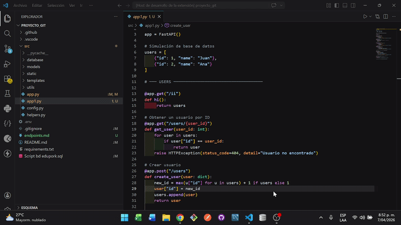
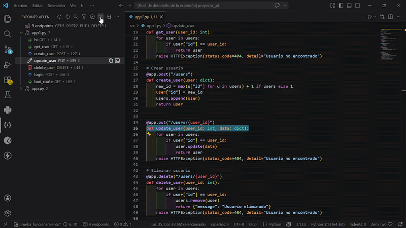
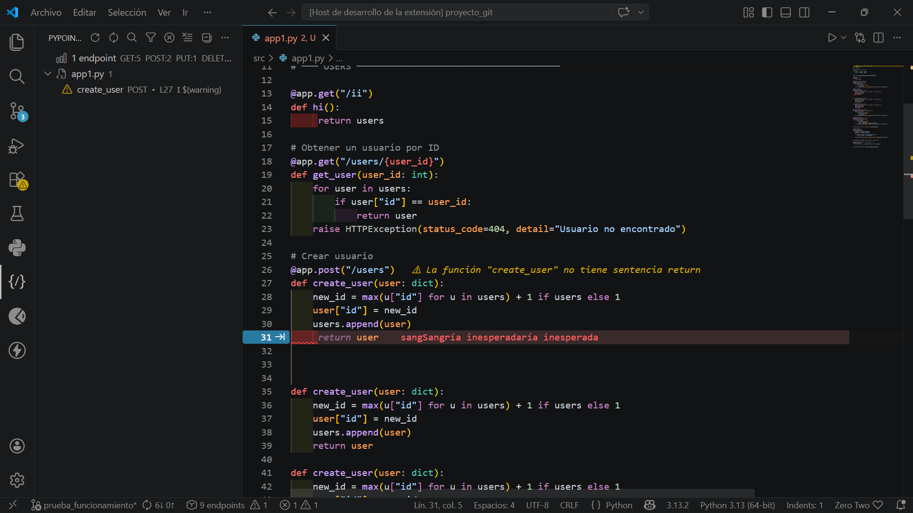
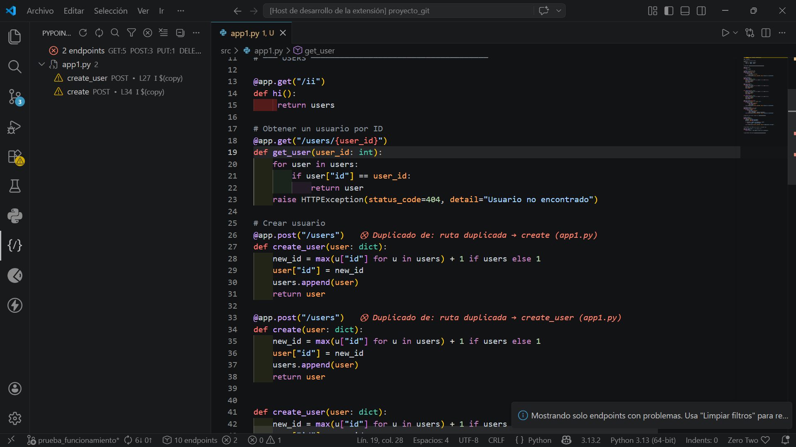
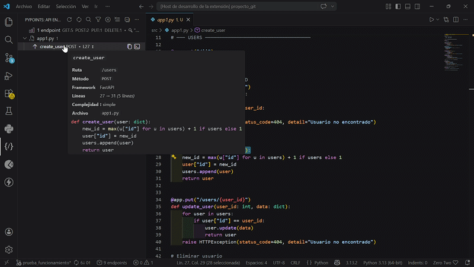
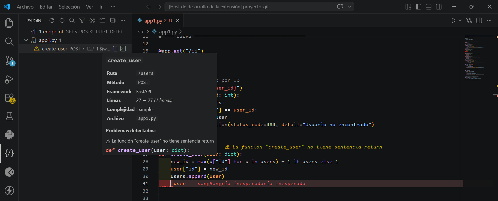

# PyPoints — Python API Endpoint Explorer

Herramienta avanzada para analizar, visualizar y entender endpoints de APIs en proyectos Python directamente desde Visual Studio Code.

PyPoints transforma tu código backend en un mapa interactivo de tu API, permitiéndote detectar errores, inconsistencias y problemas de diseño en segundos.

## Visión general

En proyectos backend reales, los endpoints suelen estar dispersos en múltiples archivos, lo que dificulta:

* Entender la arquitectura completa de la API  
* Detectar errores antes de producción  
* Mantener consistencia en rutas y métodos  
* Navegar rápidamente entre funcionalidades  

PyPoints resuelve este problema con análisis estático inteligente, centralizando toda tu API en una vista clara y accionable.

> [!TIP]
> Ideal para desarrolladores backend que trabajan con Flask, FastAPI o Django y necesitan visibilidad inmediata sobre su sistema.

## PREVIEW

### Explorador en acción



## Capacidades principales

### Exploración centralizada de endpoints

Visualiza todos los endpoints en un único panel dentro de VS Code.

* Estructura clara y jerárquica  
* Agrupación por archivo o categoría  
* Acceso directo al código fuente  
* Escalable para proyectos grandes  

> [!IMPORTANT]
> Esto elimina la necesidad de buscar manualmente rutas en múltiples archivos.

---

### Búsqueda y filtrado avanzado



Permite encontrar cualquier endpoint en segundos.

Incluye:

* Búsqueda por nombre, ruta, método o archivo  
* Filtro por método HTTP (GET, POST, etc.)  
* Vista exclusiva de endpoints con problemas  

> [!NOTE]
> En proyectos grandes, esta función reduce drásticamente el tiempo de navegación.

---

### Análisis estático y validación

PyPoints no solo detecta endpoints, también evalúa su calidad.

Detecta automáticamente:

* Rutas mal formadas  
* Parámetros inválidos  
* Uso de `print()` (debug en producción)  
* Funciones sin `return`  
* Nombres poco descriptivos  



> [!WARNING]
> Estos problemas pueden causar fallos en producción o dificultar el mantenimiento.


---

### Detección de duplicados y conflictos

Identifica errores críticos en tu API:

* Rutas duplicadas con el mismo método  
* Funciones repetidas en diferentes archivos  
* Posibles colisiones de comportamiento  



> [!IMPORTANT]
> Este tipo de errores suele pasar desapercibido hasta producción.

---

### Vista detallada de endpoints (Preview interactivo)



Cada endpoint tiene un panel completo con:

* Código fuente formateado  
* Información estructurada  
* Indicadores visuales de estado  
* Generación automática de cURL  

> [!TIP]
> Usa esta vista como alternativa ligera a herramientas como Postman.


---

### Clasificación de complejidad

PyPoints analiza automáticamente la complejidad del endpoint:

```python
Simple   (I)
Medio    (II)
Complejo (III)
```

Esto se basa en la cantidad de líneas de la función.

> [!TIP]
> Los endpoints complejos suelen ser los principales candidatos a refactorización.

---

### Integración directa con el editor

PyPoints se integra completamente en VS Code:

* Indicadores visuales en el código  
* Errores y advertencias en línea  
* Navegación instantánea al endpoint  

> [!IMPORTANT]
> No necesitas cambiar de herramienta: todo ocurre dentro de tu editor.


---

### Exportación de endpoints

Genera documentación automáticamente:

* Exportación a JSON  
* Exportación a Markdown  

> [!NOTE]
> Ideal para documentación técnica, auditorías o trabajo en equipo.

---

## Flujo de uso

1. Abre tu proyecto Python en Visual Studio Code  
2. Accede al panel de PyPoints  
3. Ejecuta "Scan Workspace"  
4. Explora, filtra y analiza tus endpoints  

> [!TIP]
> Usa la búsqueda para ubicar endpoints específicos en segundos.


---

## Ejemplo

```python
@app.get("/users")
def get_users():
    return {"users": []}
```

Resultado:

* Método: GET  
* Ruta: /users  
* Función: get_users  
* Complejidad: simple  

> [!TIP]
> Mantén el cursor sobre un endpoint para ver su información detallada.

---

## Casos de uso

* Auditoría de APIs existentes  
* Revisión de código backend  
* Identificación de errores antes de despliegue  
* Generación de documentación técnica  
* Onboarding en proyectos complejos  

--- 

## Requisitos

* Visual Studio Code ≥ 1.85  
* Proyecto en Python  

No requiere configuración adicional.

---
